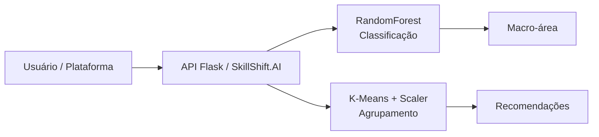
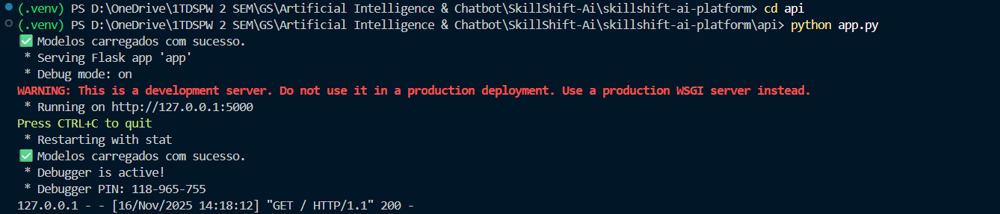
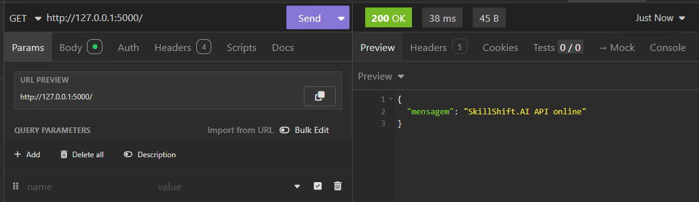
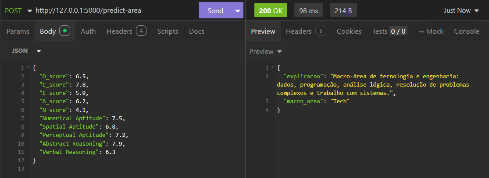
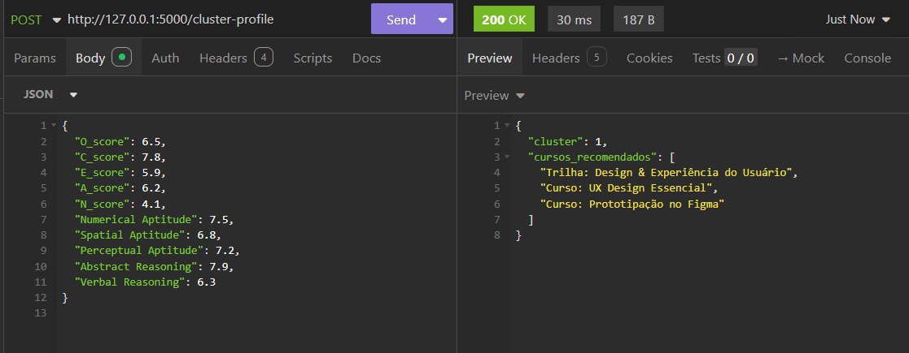

# SkillShift.AI — Plataforma de Requalificação com IA

Plataforma de requalificação profissional baseada em Inteligência Artificial criada como parte da Global Solution da FIAP. A solução sugere macro-áreas de carreira e trilhas de cursos alinhadas ao perfil psicométrico dos participantes.

## Badges


---

## Visão Geral da Arquitetura

A solução é composta por:

- **Modelo 1 — Classificação (RandomForestClassifier)**
  - Prevê **3 macro-áreas de carreira**: `Tech`, `Business`, `Human`.
  - Usa 10 features psicométricas e de aptidão.

- **Modelo 2 — Agrupamento (K-Means + StandardScaler)**
  - Agrupa perfis em **3 clusters** com base nas mesmas 10 features.
  - Cada cluster recebe uma **trilha de cursos recomendada**.

Ambos os modelos são treinados em Python, serializados em `.joblib` e carregados pela **API Flask** para respostas em tempo real.

---

## Diagrama da Arquitetura



## Arquivos dos modelos

```
api/models/
  modelo_career_area_3classes.joblib
  modelo_perfis_clusters.joblib
```

## Features utilizadas pelos modelos

```
O_score
C_score
E_score
A_score
N_score
Numerical Aptitude
Spatial Aptitude
Perceptual Aptitude
Abstract Reasoning
Verbal Reasoning
```

## Documentação da API

### A) GET /

Exemplo de resposta:

```json
{
  "mensagem": "SkillShift.AI API online"
}


### B) POST /predict-area

- Entrada: JSON contendo as 10 features.
- Saída:

  ```json
  {
    "macro_area": "Tech",
    "explicacao": "texto explicando a macro-área"
  }
  ```

### C) POST /cluster-profile

- Entrada: JSON contendo as 10 features.
- Saída:

  ```json
  {
    "cluster": 1,
    "cursos_recomendados": [...]
  }
  ```

## Exemplos de chamadas via CURL (CMD)

```bash
curl -X POST http://127.0.0.1:5000/predict-area -H "Content-Type: application/json" -d "{\"O_score\":6.5,\"C_score\":7.8,\"E_score\":5.9,\"A_score\":6.2,\"N_score\":4.1,\"Numerical Aptitude\":7.5,\"Spatial Aptitude\":6.8,\"Perceptual Aptitude\":7.2,\"Abstract Reasoning\":7.9,\"Verbal Reasoning\":6.3}"
```

```bash
curl -X POST http://127.0.0.1:5000/cluster-profile -H "Content-Type: application/json" -d "{\"O_score\":6.5,\"C_score\":7.8,\"E_score\":5.9,\"A_score\":6.2,\"N_score\":4.1,\"Numerical Aptitude\":7.5,\"Spatial Aptitude\":6.8,\"Perceptual Aptitude\":7.2,\"Abstract Reasoning\":7.9,\"Verbal Reasoning\":6.3}"
```

## Exemplo de uso em Python

```python
import requests

payload = { ... }

r = requests.post("http://127.0.0.1:5000/predict-area", json=payload)
print(r.json())
```

## Instalação e Execução da API

```
python -m venv .venv
.\.venv\Scripts\Activate.ps1
pip install -r requirements.txt
cd api
python app.py
```

## Estrutura do Projeto

```
SKILLSHIFT-AI-PLATFORM/
│
├── .git/
├── api/
│   ├── app.py
│   └── models/
│       ├── modelo_career_area_3classes.joblib
│       └── modelo_perfis_clusters.joblib
│
├── data/
│   └── Data_final.csv
│
├── notebooks/
│   ├── SkillShift_Ai_Platform.ipynb
│   └── skillshift_ai_platform.py
│
├── integrantes.txt
├── requirements.txt
└── README.md
```


## Evidências de Execução

Abaixo, alguns prints de execução local da API:

1. **API Flask iniciada com sucesso**

   

2. **Resposta da rota GET /**

   

3. **Resposta do POST /predict-area**

   

4. **Resposta do POST /cluster-profile**

   

## Aviso sobre compatibilidade

Os modelos foram treinados e executados com a mesma versão principal do scikit-learn (linha 1.x).  
Versões diferentes podem gerar *warnings* de compatibilidade, mas não impedem a execução da API.

